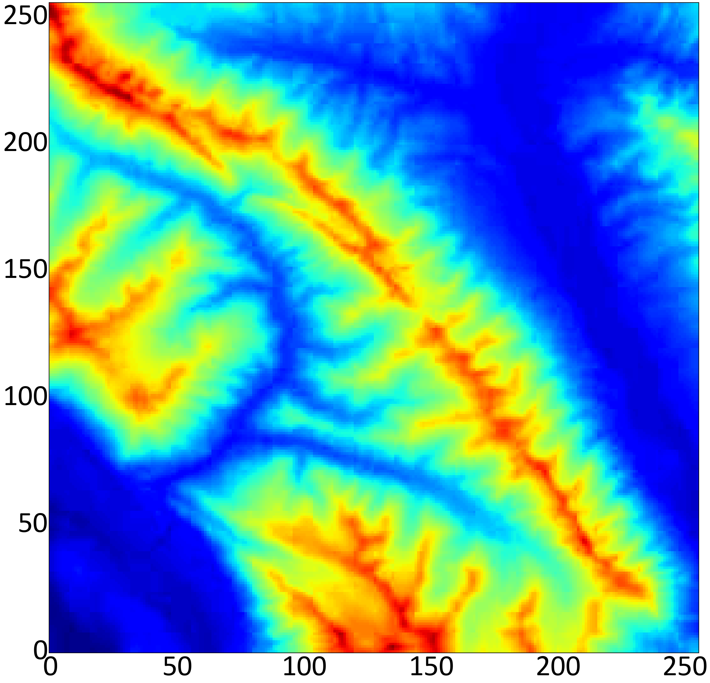

# Evaluation of the Significance of Trends

This repository contains the text files of an example of synthetic data and five real images presented in the article titled "Evaluation of the Significance of Spatial Trends for Geostatistical Simulation."

## Synthetic Data

- 

The synthetic data consists of 50% variance originating from the trend and 50% from the simulation.

## Real Images

The following real images are included:
- 
- 
- 
- 
- 

## Contact

If you have any questions or suggestions, please contact Thiago A Mizuno at thiagomizuno@gmail.com.
